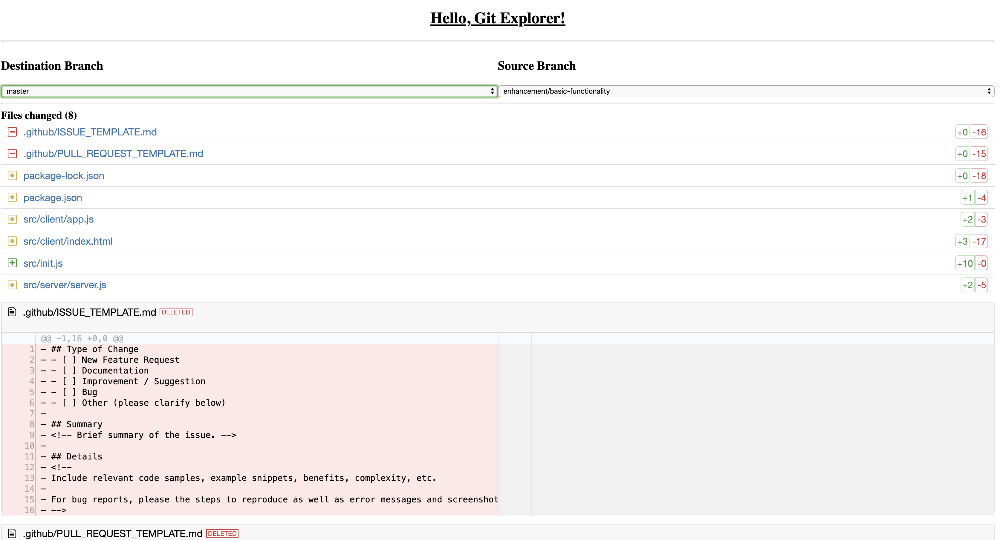

# git-explorer

[](https://github.com/thescientist13/git-explorer/tags)
[](https://github.com/thescientist13/git-explorer)


## Overview
Git Explorer is a local development tool that provides offline-first support for previewing and comparing branches in a local git repository.



## Usage
You can use the project locally on your system a couple different ways, depending on your preference.  You will need to have [NodeJS](https://nodejs.org/) LTS installed on your machine.

> _After running these commands, you can view the explorer web app in your browser at `localhost:3000`_.

### One Time (npx)
Use `npx` to use the project (while online) for any local repository you have.
```shell
$ cd /path/to/your/repo
$ npx git-explorer
```

> This approach will always use the latest version of **git-explorer** published to npm.

### Offline (global npm / Yarn)
By installing **git-explorer** globally, you can aceess the tool even if you're offline!  Just use your preferred package manager's global installation command and then run the tool from the directory of your local repository.
```shell
# npm
$ npm install -g git-explorer

# or with Yarn
$ yarn add --global git-explorer

# now run git-explorer from your local repo
$ cd path/to/your/repo
$ git-explorer
```

> To upgrade your global install of **git-explorer** to a newer version, just re-run the global installation command again.

### Options

#### Port

By default, Git Explorer runs on port `3000`. To run it on a different port, you can pass a custom `--port` flag.  Example:
```shell
$ npx git-explorer --port 4200
```

#### Open

 To automatically open the default browser on start of the server, you can pass a custom `--open` flag. Example:
```shell
$ npx git-explorer --open
```

## Contributing
Contributions are welcome either in the form of code or ideas!

### Ideas / Feature Requests
See something you want to have included in Git Explorer?  Feel free to [open an issue](https://github.com/thescientist13/git-explorer/issues), and if you're feeling ambitious, submit a PR!

### Development
To develop for the project, make sure you have [NodeJS](https://nodejs.org/) and [Git](https://git-scm.com/) installed.

Then, you can do the following:
1. Clone the repo
1. Run `npm ci`
1. Run `npm start`

You should now be able to see the project running on `localhost:3000`

> _**Note**: If you make changes to src/server.js, make sure to restart the server by killing the server and re-running `npm start`_